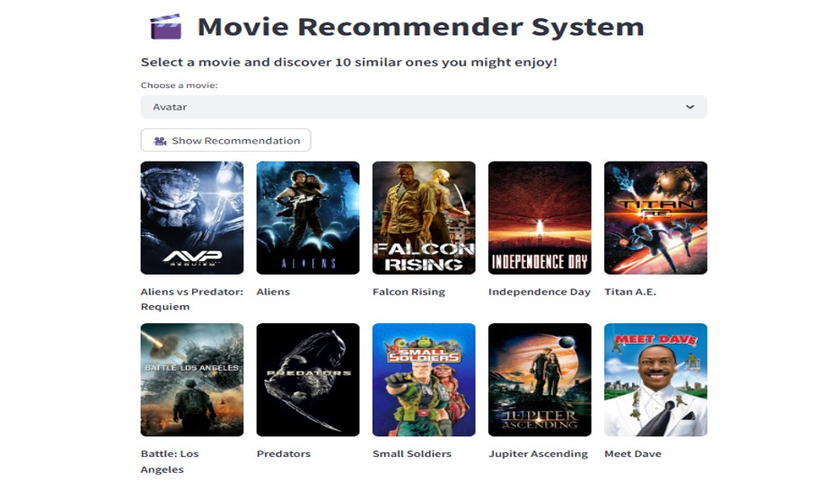

# 🎬 Content-Based Movie Recommender System

This project is a personalized movie recommendation system that suggests similar movies based on their content features such as **genres, keywords, cast, and overview**. It uses **Natural Language Processing (NLP)** and similarity measures to provide accurate and efficient movie recommendations.

Built with a real-time user interface using **Streamlit**, the application allows users to input a movie title and get top recommended movies instantly.

---

## 📌 Features

- ✅ Content-based filtering using metadata (overview, genres, cast, keywords)
- ✅ Text vectorization using **CountVectorizer**
- ✅ Similarity scoring using **Cosine Similarity**
- ✅ Real-time recommendations through **Streamlit** interface
- ✅ Fast and efficient retrieval with preprocessed and optimized data

---

## 🧠 How It Works

1. Combine important metadata into a single text feature.
2. Convert text into numerical vectors using `CountVectorizer`.
3. Compute similarity scores between movies using `Cosine Similarity`.
4. Return top N movies with highest similarity to the input movie.

---

## 🛠️ Tech Stack

- **Python**
- **Pandas**
- **Scikit-learn**
- **CountVectorizer**
- **Cosine Similarity**
- **Streamlit**

---
## 📸 Screenshots

### 🔹 Streamlit Interface
### 🔹 Homepage

